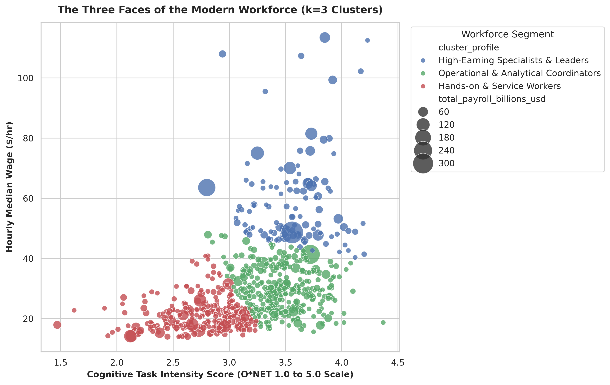

[📥 Download PDF Briefing](reports/executive_report.pdf)

# The Innovation Dilemma: How Geopolitical Shocks, Interest Rates, and Administrative Friction Shape Modern Work

**An empirical investigation into why macro crises accelerate software adoption while bureaucratic coordination traps over $1.5 trillion in skilled labor value.**

---

## Executive Summary

When global crises erupt, the immediate financial shockwaves are swift and punishing. Energy prices spike overnight, supply routes are thrown into disarray, and central banks are forced to hike interest rates to combat resurgent inflation. For executive leadership and corporate boards, this creates an acute operational squeeze: the cost of borrowed capital surges at the exact moment operating expenses rise, compressing profit margins across every sector of the economy. Conventional economic wisdom suggests that under such severe financial strain, businesses should broadly slash technology investments and delay modernizations until calm returns.

Yet empirical reality reveals the opposite. Rather than abandoning tech spending during periods of macroeconomic turbulence, companies consistently protect -- and often expand -- their investments in enterprise software. When capital becomes expensive and supply chains fracture, software ceases to be a speculative corporate luxury; it becomes non-negotiable operational plumbing. Organizations rely on automation, cloud architecture, and digitized workflows to defend their bottom lines, maintain visibility into volatile inputs, and do more without taking on expensive variable headcount.

However, this rush toward technological modernization exposes a profound bottleneck in the structure of the economy. The greatest untapped frontier for productivity gains is not automating low-wage manual labor, which has already been heavily rationalized, nor is it displacing entry-level workers. Instead, the real bottleneck sits at the very top of corporate payrolls: highly educated, highly compensated professionals -- including general managers, physicians, attorneys, and specialized engineers -- who spend a staggering portion of their workweek trapped in administrative paperwork, compliance documentation, and routine scheduling. Resolving this "Coordination Tax" represents the single largest economic opportunity of the coming decade.

---

## 1. The Anatomy of a Market Panic: Visualizing the Flashpoint

To understand how macroeconomic volatility influences corporate investment and workforce strategy, we must first examine how markets react when a geopolitical crisis breaks out. Looking at high-frequency daily trading data reveals sharp, non-linear dynamics that are completely erased when viewing traditional quarterly or annual averages.

As demonstrated across the top row of **Figure 1**, daily market behavior transforms radically during crisis regimes:
- **Brent Crude Oil**: The distribution of daily returns widens dramatically, exhibiting fat tails with single-day swings exceeding $\pm 5\%$.
- **EUR / USD Foreign Exchange**: Currency volatility escalates as global capital flees toward the US dollar, placing extreme foreign exchange pressure on multinational balance sheets.
- **US 10-Year Treasury Yields**: Daily yield changes oscillate violently as fixed-income investors alternate between safe-haven government bond buying and fears of sustained inflationary pressure.

The bottom row of **Figure 1** highlights annualized realized 21-day volatility. During baseline conditions, median oil volatility hovers around 30%; during crisis shock regimes, it surges toward 50%, with acute spikes crossing 80%.

### The Event Study: Why Monthly Averages Miss the Whole Story

Traditional monthly economic indicators frequently fail to capture the urgency facing corporate executives. By averaging prices over an entire calendar month, standard metrics smooth out the violent peaks and troughs that drive operational decisions in real time.

Tracing market trajectories across an event window from **5 days prior to 25 days following** major geopolitical flashpoints reveals an acute operational pattern:
1. **The 8-Day Energy Surge**: Crude oil prices spike rapidly, gaining 15% to 20% within the first 8 trading days before plateauing and partially retracing as supply rerouting begins.
2. **The Flight-to-Safety and Inflationary Reversal**: Government borrowing rates initially decline during the first 48 hours as panicked capital rushes into sovereign US bonds. However, within two weeks, bond markets realize that energy price spikes will fuel persistent inflation, prompting interest rates to reverse violently upward.
3. **The Executive Dilemma**: A company operating with a monthly reporting cycle only sees a modest blip in average input costs. But leadership on the ground must navigate sudden cost surges, supplier renegotiations, and financing shocks in a matter of days.

---

## 2. Why Companies Keep Buying Software When Money Gets Expensive

When interest rates rise from near-zero to 4% or 5%, corporate finance textbooks predict a broad contraction in corporate capital investment. When the cost of capital quadruples, long-dated projects are supposed to be deferred or scrapped. 

However, empirical examination of quarterly national investment data reveals a surprising divergence between **discretionary physical expansion** and **software infrastructure spending**.

### Strategic Capital Allocation Under Macroeconomic Stress

| Investment Category | Strategic Objective | Budgetary Action | Operational Rationale | Typical Corporate Initiatives |
| :--- | :--- | :---: | :--- | :--- |
| **Discretionary Capital Expansion** | Long-cycle experimental growth & footprint expansion | **Slashed / Deferred** | Conserves immediate cash liquidity; hurdle rates become prohibitively high as borrowing costs rise. | Physical real estate, speculative venture R&D, new plant construction, speculative exploratory bets. |
| **Defensive Operational Software** | Margin defense, cost containment & operational resilience | **Protected / Accelerated** | Delivers rapid operating efficiencies to offset rising input costs and wage inflation without adding headcount. | Cloud ERP & CRM systems, supply chain intelligence, workflow automation, inventory tracking. |

### Discretionary Spending vs. Non-Negotiable Plumbing

When borrowing rates increase and geopolitical uncertainty clouds the revenue outlook, corporate finance teams ruthlessly categorize balance sheet expenses into two buckets:

1. **Discretionary Speculation**: Multi-year experimental research and development, speculative product incubations, and large-scale physical footprint expansions are easily paused or scaled back. In high-rate environments, the hurdle rate for experimental R&D becomes prohibitively high.
2. **Defensive Efficiency (Software & Automation)**: Enterprise software spending exhibits remarkable resilience. When input costs rise and wage inflation mounts, software becomes the primary mechanism through which executives protect operating margins. Automating inventory reconciliation, optimizing logistics routes, and consolidating IT systems directly reduces overhead costs.

Companies do not purchase enterprise software during crises because they feel wealthy; they purchase it because they are under siege. Software investments function as an operational hedge -- a capital expenditure that delivers immediate operating efficiencies to counter rising macroeconomic friction.

---

## 3. The Three Faces of the Modern Workforce

Because organizations rely on software to defend margins during periods of macroeconomic stress, understanding where technology interacts with human labor is critical. Unsupervised machine learning analysis of national labor market data across **696 distinct occupations** reveals that the modern workforce divides naturally into three fundamental economic segments:

### Summary Profile: The 3-Cluster Workforce Model

| Workforce Segment | Occupation Count | Median Hourly Wage | Cognitive Task Score (1 to 5) | Automation Pressure Index | Total National Payroll Volume | Economic Vulnerability & Strategic Role |
| :--- | :---: | :---: | :---: | :---: | :---: | :--- |
| **High-Earning Specialists & Leaders** | **112** | **$58.84 / hr** | **3.58** | **212.5** | **$2,502 Billion ($2.50T)** | **Strategic AI Target**: High wage costs create huge ROI for cognitive augmentation; constrained by coordination drag. |
| **Operational & Analytical Coordinators** | **309** | **$29.35 / hr** | **3.47** | **102.3** | **$2,860 Billion ($2.86T)** | **Immediate Margin Target**: Heavily digital and rules-based; primary focus of workflow automation during cost cuts. |
| **Hands-on & Service Workers** | **275** | **$21.40 / hr** | **2.76** | **59.7** | **$2,683 Billion ($2.68T)** | **Insulated from Software**: Physical manipulation, in-person care, and unpredictable tactile environments software cannot reach. |

### Economic Profile Breakdown

1. **High-Earning Specialists & Leaders (The Intellectual Engine)**:
   - *Representative Roles*: Corporate Executives, Surgeons, Software Architects, Senior Legal Counsel, Financial Directors.
   - *Characteristics*: Earning nearly three times the national average wage, these professionals drive strategic innovation and critical decisions. Because their time is so expensive, any productivity enhancement here produces immense economic value.
2. **Operational & Analytical Coordinators (The Digital Middle Class)**:
   - *Representative Roles*: Financial Analysts, Claims Adjusters, Database Administrators, Supply Chain Planners.
   - *Characteristics*: These workers operate the day-to-day administrative and analytical engines of modern enterprise. Because their work takes place almost entirely behind screens and follows structured protocols, this group faces the most direct pressure when companies look to streamline headcount during downturns.
3. **Hands-on & Service Workers (The Physical Foundation)**:
   - *Representative Roles*: Electricians, Heavy Equipment Mechanics, Paramedics, Home Health Aides, Agricultural Technicians.
   - *Characteristics*: While these workers earn lower hourly wages, their roles require tactile dexterity, spatial navigation, and empathetic human contact. As a result, they remain largely insulated from software disruption.

---

## 4. The Paperwork Trap: Augmentation Potential vs. Administrative Drag

The prevailing narrative surrounding automation suggests that technology primarily threatens low-wage, routine workers. However, by disaggregating daily job activities into distinct functional components, our research uncovers an entirely different reality: **the true bottleneck in the modern economy is the "Paperwork Trap."**

We mapped the labor market across two fundamental dimensions:
- **Augmentation Potential (Brainpower & Synthesis)**: The degree to which an occupation involves complex problem-solving, strategic synthesis, creative ideation, and decision-making under uncertainty.
- **Administrative Drag (Bureaucracy & Coordination)**: The degree to which an occupation is burdened by compliance documentation, scheduling, progress reporting, routine email coordination, and repetitive data entry.

### The 2x2 Labor Friction Matrix

The intersection of these two axes divides the economy into four distinct quadrants:

- **Quadrant 1 (High Augmentation / Low Drag -- Pure High-Leverage Specialists)**: Occupations characterized by intensive creative synthesis, strategic autonomy, and minimal bureaucratic burden (e.g., Creative Directors, Specialized Researchers). These professionals operate with high personal leverage and produce outsized value unencumbered by process friction.
- **Quadrant 2 (High Augmentation / High Drag -- The Primary Economic Bottleneck)**: Highly compensated, highly educated cognitive talent whose productive capacity is choked by heavy administrative and regulatory overhead (e.g., General & Operations Managers, Physicians, Technical Directors). This segment represents the largest concentration of trapped economic value in the modern workforce.
- **Quadrant 3 (Low Augmentation / Low Drag -- Physical & Frontline Services)**: Manual trades, physical construction, and in-person service roles requiring tactile manipulation, spatial reasoning, and direct human care with minimal administrative paperwork (e.g., Electricians, Roofers, Heavy Equipment Mechanics). These roles are structurally insulated from cognitive software disruption.
- **Quadrant 4 (Low Augmentation / High Drag -- Routine Administrative Clerical)**: Traditional administrative, record-keeping, and operational support roles dominated by repetitive data entry and rule-based clerical tasks (e.g., General Office Clerks, Data Entry Keyers). These positions face the highest displacement pressure from automated workflows.

### The $1.5 Trillion "Coordination Tax"

**Quadrant 2 (The Top-Right Red Cluster)** represents the single largest reservoir of trapped economic potential in the world. These are not clerical workers; they are the most expensive, highly trained minds in healthcare, enterprise leadership, engineering, and law.

Yet, as shown in the empirical ranking below, these exact professionals are drowning in administrative overhead:

| Rank | Occupation Title | Hourly Median Wage | Total Annual Payroll Volume | Brainpower Score (Augmentation) | Paperwork Score (Admin Drag) | The Core Coordination Bottleneck |
| :---: | :--- | :---: | :---: | :---: | :---: | :--- |
| **1** | **General & Operations Managers** | **$48.69** | **$355.3 Billion** | 4.02 | 3.78 | Cross-department status meetings, resource allocation spreadsheets, approval chasing. |
| **2** | **Registered Nurses** | **$41.38** | **$273.3 Billion** | 4.05 | 4.41 | Electronic Health Record (EHR) chart documentation, medication reconciliation logs. |
| **3** | **Lawyers** | **$70.08** | **$106.6 Billion** | 3.99 | 3.72 | Billing timecard logging, boilerplate contract review, court filing compliance. |
| **4** | **Computer & Information Systems Managers** | **$81.50** | **$100.5 Billion** | 4.01 | 3.56 | Jira ticketing hygiene, sprint capacity planning, cross-functional status reporting. |
| **5** | **First-Line Supervisors of Office Support** | **$30.50** | **$95.5 Billion** | 3.80 | 3.76 | Staff scheduling, attendance monitoring, dispute resolution logs. |
| **6** | **Project Management Specialists** | **$47.39** | **$93.4 Billion** | 3.79 | 3.71 | Status update drafting, milestone chasing, stakeholder slide-deck creation. |
| **7** | **Business Operations Specialists** | **$38.26** | **$87.8 Billion** | 3.76 | 3.53 | Vendor compliance verifications, procurement routing, internal audit tracking. |
| **8** | **Management Analysts (Consultants)** | **$47.80** | **$83.3 Billion** | 4.19 | 3.77 | Document formatting, interview transcription, deck re-formatting. |
| **9** | **Corporate Managers (All Other)** | **$64.21** | **$78.8 Billion** | 3.98 | 3.80 | Governance reporting, policy compliance checks, budget reconciliation. |
| **10** | **Sales Managers** | **$64.98** | **$77.8 Billion** | 4.00 | 3.97 | CRM pipeline entry, commission sign-offs, sales forecast reporting. |
| **11** | **Physicians (All Other)** | **$113.46** | **$73.2 Billion** | 4.11 | 4.28 | Insurance pre-authorizations, clinical note coding, referral correspondence. |
| **12** | **Medical & Health Services Managers** | **$53.21** | **$57.0 Billion** | 4.02 | 4.12 | Regulatory compliance reporting, credentialing audits, hospital shift logs. |
| **13** | **Computer Systems Analysts** | **$49.90** | **$51.8 Billion** | 4.06 | 3.74 | Requirement trace matrices, system change-request forms, architecture tickets. |
| -- | **Top 15 Quadrant 2 Total** | -- | **$1,534.3 Billion** | -- | -- | **Over $1.53 Trillion in annual payroll constrained by administrative overhead.** |

When a hospital pays an emergency physician $113 per hour, but that physician is forced to spend two hours typing clinical notes into an Electronic Health Record system for every one hour spent with patients, that hospital is paying an enormous **Coordination Tax**. 

When a technology firm pays a software engineering manager $81 per hour to spend half their week updating Jira tickets and attending alignment meetings, valuable cognitive capital is effectively squandered. Across just the top 15 occupations in Quadrant 2, **over $1.53 trillion in annual payroll is tied up in administrative friction**.

---

## 5. Conclusion & Looking Forward

Modern organizations face a compounding series of external challenges: energy volatility, rising cost of capital, and persistent geopolitical disruption. In response, leadership teams have correctly recognized that technology is their most potent tool to defend profitability and survive turbulent markets.

However, the prevailing corporate playbook remains fundamentally flawed. For the past decade, cost-cutting initiatives have centered on eliminating frontline headcount or automating routine customer-facing interactions. Our empirical findings demonstrate that this strategy targets the wrong end of the economic spectrum.

### The Strategic Capital Misalignment

| Strategic Dimension | Traditional Playbook: Frontline Headcount Displacement | Recommended Strategy: Quadrant 2 Friction Elimination |
| :--- | :--- | :--- |
| **Target Occupations** | Customer service, retail clerks, entry-level admin ($15 - $25/hr) | Doctors, Operations Managers, Legal Counsel, Tech Directors ($50 - $115+/hr) |
| **Economic Value Realized** | Modest dollar savings per displaced worker ($30k - $50k/yr) | Massive dollar value liberated per hour of administrative drag removed |
| **Organizational Impact** | High employee resistance, cultural morale collapse, service degradation | Eliminates burnout, restores focus on high-margin synthesis, accelerates execution |
| **Macro Resilience** | Fragile; fails to resolve cross-functional coordination bottlenecks | Robust; scales operational throughput and decision velocity during volatile shocks |
| **Strategic Leverage** | Incremental cost cutting with rapidly diminishing returns | Exponential operational leverage and permanent structural margin defense |

### The Strategic Directive for Leadership

1. **Shift Focus from Headcount Reduction to Friction Removal**: The objective of deploying modern artificial intelligence and workflow automation should not be eliminating the $20-per-hour technician; it must be liberating the $80-per-hour manager from administrative drudgery.
2. **Attack the Coordination Tax First**: Organizations should audit the weekly time allocation of their highest-compensated talent. Any tool that eliminates insurance pre-authorizations for doctors, automated legal contract comparison for lawyers, or sprint documentation for engineering directors generates immediate, high-margin ROI.
3. **Build Operational Resilience for Macro Shocks**: Because geopolitical and interest rate shocks occur suddenly and recover non-linearly, organizations cannot rely on slow, manual decision-making. Digital plumbing that provides real-time operational visibility is the only viable defense against macro instability.

The true promise of technological progress is not cutting jobs to survive the next crisis -- it is dismantling the administrative prison that keeps our most talented minds from doing the work they were hired to do.
