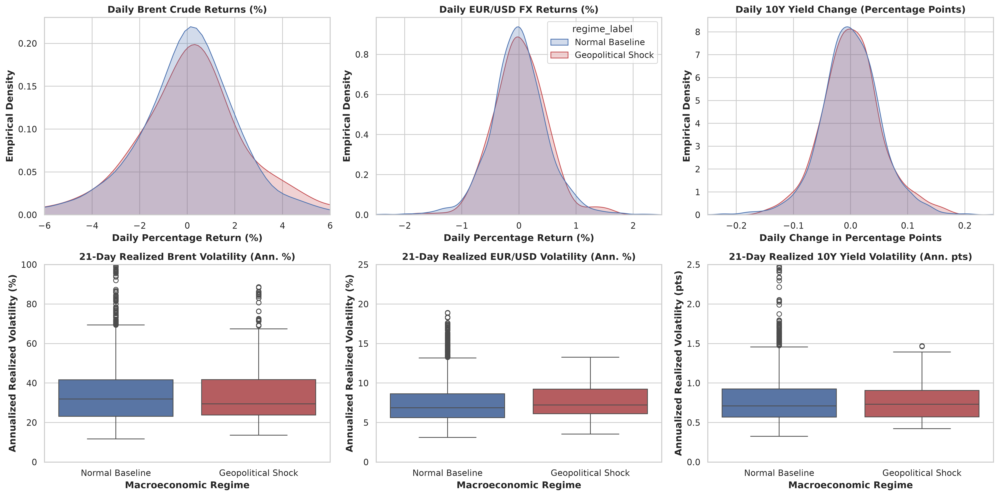
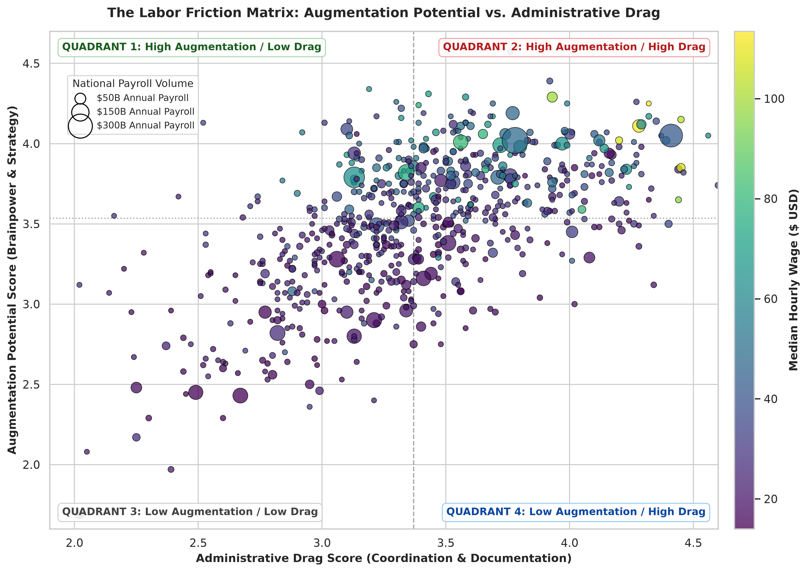

[📥 Download PDF Briefing](reports/executive_report.pdf)

# The Innovation Dilemma: How Geopolitical Shocks, Interest Rates, and Administrative Friction Shape Modern Work

**An empirical investigation into why macro crises accelerate software adoption while bureaucratic coordination traps over $1.5 trillion in skilled labor value.**

---

## Executive Summary

When global conflict erupts, the economic shockwaves hit businesses immediately. Energy prices surge overnight, shipping routes face disruption, and central banks raise interest rates to combat inflation. As fuel and materials become more expensive, borrowing money to fund everyday operations becomes far more costly. For executive leadership and corporate boards, this dynamic creates a severe operational squeeze. Profit margins shrink rapidly across every sector, forcing companies to scrutinize every single dollar of expenditure.

Yet empirical reality reveals a surprising reaction. Rather than slashing technology spending to preserve cash, companies consistently protect, and even increase, their software budgets. During periods of macroeconomic turbulence, software ceases to be an optional luxury or a speculative experiment. Instead, software acts as essential operational plumbing to prevent waste, defend operating margins, and track volatile inputs. Organizations rely on automation, cloud platforms, and digitized workflows to accomplish more work without taking on expensive variable headcount.

However, this rush toward modernization exposes a profound bottleneck in the modern economy. The greatest untapped opportunity for modern technology is not replacing low wage frontline workers who have already experienced extensive optimization. Instead, the true bottleneck sits right at the top of corporate payrolls: highly educated, high earning professionals (including general managers, physicians, corporate attorneys, and specialized engineers) who spend a massive portion of their workweek trapped in administrative paperwork, compliance logs, and routine scheduling. Resolving this Coordination Tax represents the single largest economic opportunity of the coming decade.

---

## 1. The Anatomy of a Market Panic: Visualizing the Flashpoint

To understand how macroeconomic volatility influences corporate strategy, we must first examine how financial markets react when a geopolitical crisis breaks out. Looking at daily trading data reveals sharp, sudden dynamics that completely disappear when viewing traditional quarterly or annual averages.

In normal times, daily market movements remain relatively calm and predictable. During a crisis, market behavior transforms violently:
* **Brent Crude Oil**: The distribution of daily price returns widens dramatically, exhibiting fat tails with single day swings exceeding 5% in either direction.
* **EUR / USD Foreign Exchange**: Currency volatility accelerates as global capital flees toward the US dollar as a safe haven, placing immediate exchange rate pressure on multinational balance sheets.
* **US 10 Year Treasury Yields**: Daily bond yield changes oscillate unpredictably as fixed income investors alternate between safe haven buying and fears of sustained inflation.

Looking at annualized 21 day volatility highlights this contrast. Under baseline conditions, median oil volatility hovers near 30%. During crisis regimes, it surges toward 50%, with acute spikes crossing 80%.

### The 8 Day Reality Check: Why Monthly Averages Miss the Story

Standard economic metrics rely on monthly averages, but monthly averages conceal the urgency facing company leadership. Averaging prices across an entire month smooths out the violent peaks that dictate immediate operational decisions.

Tracing market trajectories across an event window from 5 days prior to 25 days following major geopolitical flashpoints reveals an acute operational pattern:
1. **The 8 Day Energy Surge**: Crude oil prices spike rapidly, surging 15% to 20% in an intense 8 day window before beginning to level off as alternative supply routes are arranged.
2. **The Inflationary Reversal**: Government borrowing rates initially dip during the first 48 hours as capital rushes into sovereign bonds. Within two weeks, bond markets realize that energy spikes will produce persistent inflation, causing borrowing rates to reverse sharply upward.
3. **The Executive Dilemma**: A company looking only at monthly reports sees a modest bump in average costs. In contrast, managers on the ground must deal with the panic in real time, absorbing immediate supplier price increases, logistical disruptions, and unexpected financing shocks.

---

## 2. Why Companies Keep Buying Software When Money Gets Expensive

When interest rates jump from near zero to 5%, standard financial theories predict that companies should hoard cash and delay major technology investments. When the cost of capital quadruples, speculative projects are shelved. Why, then, do companies continue buying software during crises?

### Strategic Capital Allocation Under Macroeconomic Stress

| Investment Category | Strategic Objective | Budgetary Action | Operational Rationale | Typical Corporate Initiatives |
| :--- | :--- | :--- | :--- | :--- |
| **Discretionary Capital Expansion** | Long cycle experimental growth and physical expansion | **Slashed or Delayed** | Conserves cash liquidity because hurdle rates become prohibitively high when borrowing costs surge. | New physical warehouses, speculative venture labs, regional office expansions, physical machinery additions. |
| **Defensive Operational Software** | Margin defense, cost containment, and operational resilience | **Protected or Accelerated** | Delivers rapid operating efficiencies to offset rising input costs and inflation without adding headcount. | Route optimization, automated invoicing, inventory tracking, cloud ERP platforms, automated scheduling. |

### The Real World Fleet Example

Consider the practical situation of a regional logistics company operating a fleet of 50 delivery trucks. 

When diesel prices jump by 30% and commercial borrowing rates rise from 3% to 7%, the company faces immediate margin destruction. The leadership team immediately cancels plans to purchase 5 new physical trucks and delays construction of a planned regional warehouse depot. That expansion would require expensive debt financing and add fixed overhead.

Instead, the company immediately approves an expenditure of $35,000 for route optimization and fuel monitoring software. By using software to dynamically optimize delivery sequences and eliminate idle engine time, the company cuts total fleet mileage by 8%. That 8% reduction saves more than $70,000 in annual fuel expenditures while allowing the existing 50 trucks to handle the delivery volume originally planned for 55 trucks. 

The logistics company does not buy software because it has cash to burn. It buys software as an operational shield to survive margin pressure.

---

## 3. The Three Faces of the Modern Workforce (3 Clusters)

Because organizations rely on software to defend margins during periods of stress, understanding where technology interacts with human labor is essential. Statistical clustering analysis across 696 distinct occupations reveals that the modern workforce divides naturally into three fundamental economic segments:

### Summary Profile: The 3 Cluster Workforce Model

| Workforce Segment | Occupation Count | Median Hourly Wage | Cognitive Task Score (1 to 5) | Total National Payroll Volume | Economic Role and Vulnerability |
| :--- | :--- | :--- | :--- | :--- | :--- |
| **High Earning Specialists and Leaders** | 112 | $58.84 / hr | 3.58 | $2,502 Billion ($2.50T) | **Strategic AI Opportunity**: Expensive cognitive talent where freeing time from coordination drag yields enormous financial returns. |
| **Operational and Analytical Coordinators** | 309 | $29.35 / hr | 3.47 | $2,860 Billion ($2.86T) | **Immediate Automation Target**: Screen based, rules driven work that faces direct displacement from software scripts. |
| **Hands on and Service Workers** | 275 | $21.40 / hr | 2.76 | $2,683 Billion ($2.68T) | **Insulated from Software**: Physical manipulation, in person care, and tactile dexterity that software cannot replicate. |

### The Hospital Analogy: Grounding the Three Groups

To understand how these three workforce segments operate in practice, consider the daily operations of a modern hospital:

* **Group 1: The Surgeon at $113 per hour (High Earning Specialist)**:
  The surgeon performs high stakes surgical procedures and critical clinical diagnoses. Their specialized judgment generates immense economic value. Yet throughout each shift, this surgeon spends several hours logging surgical codes, completing electronic health record forms, and fulfilling compliance requirements. Their brainpower is heavily constrained by administrative friction.
* **Group 2: The Medical Billing Specialist at $28 per hour (Digital Coordinator)**:
  The billing specialist sits behind three computer monitors matching insurance diagnostic codes, submitting reimbursement claims, and managing appointment schedules. Because this work takes place entirely behind a screen and follows structured protocols, this role faces the most immediate pressure from automated software workflows.
* **Group 3: The Patient Care Aide at $21 per hour (Hands on Foundation)**:
  The care aide physically assists patients out of bed, prepares medical instruments, and transports diagnostic equipment through hospital corridors. Because this work requires physical presence, tactile dexterity, and human empathy, software algorithms cannot displace it.

---

## 4. The Paperwork Trap: Augmentation Potential vs. Administrative Drag

Popular discussions often assume that automation primarily threatens routine, manual labor. However, decomposing daily occupational tasks into functional components reveals a very different reality. The single greatest bottleneck in modern business is the Paperwork Trap.

We mapped the national labor market across two distinct dimensions:
* **Augmentation Potential**: The degree to which an occupation demands brainpower, strategy, creative problem solving, synthesis, and decision making under uncertainty.
* **Administrative Drag**: The degree to which an occupation is burdened by compliance documentation, scheduling, progress reporting, routine email coordination, and repetitive data entry.

### The Four Quadrants of Modern Labor

The intersection of these two dimensions divides the economy into four distinct quadrants:

* **Quadrant 1: High Augmentation with Low Drag (Pure High Leverage Specialists)**: Occupations characterized by intensive creative synthesis, strategic autonomy, and minimal bureaucratic burden (such as creative directors, research scientists, and specialized design architects). These professionals operate with high personal leverage and produce outsized value unencumbered by administrative drag.
* **Quadrant 2: High Augmentation with High Drag (The Primary Economic Bottleneck)**: Highly compensated, highly educated cognitive talent whose productive capacity is choked by heavy administrative and regulatory overhead (such as operations managers, physicians, corporate lawyers, and engineering directors). This group represents the largest concentration of trapped economic value in the modern economy.
* **Quadrant 3: Low Augmentation with Low Drag (Physical and Frontline Services)**: Manual trades, physical construction, and in person service roles requiring tactile manipulation, spatial awareness, and direct human care with minimal administrative paperwork (such as electricians, roofers, and mechanics). These roles remain structurally insulated from software automation.
* **Quadrant 4: Low Augmentation with High Drag (Routine Administrative Clerical)**: Traditional administrative, record keeping, and operational support roles dominated by repetitive data entry and rule based clerical tasks (such as general office clerks and data entry keyers). These positions face the highest displacement pressure from automated workflows.

### The $1.5 Trillion Coordination Tax

Quadrant 2 represents the single largest reservoir of trapped economic potential in the modern workforce. These are not low wage clerks. They are the most expensive, highly trained minds across healthcare, enterprise management, engineering, and law.

Examining the top 15 occupations in Quadrant 2 reveals the staggering scale of this bottleneck:

| Rank | Occupation Title | Hourly Median Wage | Total Annual Payroll Volume | Brainpower Score (Augmentation) | Paperwork Score (Admin Drag) | The Core Coordination Bottleneck |
| :--- | :--- | :--- | :--- | :--- | :--- | :--- |
| **1** | **General and Operations Managers** | **$48.69** | **$355.3 Billion** | 4.02 | 3.78 | Cross departmental status meetings, resource allocation spreadsheets, approval chasing. |
| **2** | **Registered Nurses** | **$41.38** | **$273.3 Billion** | 4.05 | 4.41 | Electronic Health Record chart documentation, medication reconciliation logs. |
| **3** | **Lawyers** | **$70.08** | **$106.6 Billion** | 3.99 | 3.72 | Billing timecard logging, boilerplate contract review, court filing compliance. |
| **4** | **Computer and Information Systems Managers** | **$81.50** | **$100.5 Billion** | 4.01 | 3.56 | Project tracking hygiene, sprint capacity planning, cross team status reporting. |
| **5** | **First Line Supervisors of Office Support** | **$30.50** | **$95.5 Billion** | 3.80 | 3.76 | Staff scheduling, attendance monitoring, internal dispute resolution logs. |
| **6** | **Project Management Specialists** | **$47.39** | **$93.4 Billion** | 3.79 | 3.71 | Status update drafting, milestone chasing, stakeholder presentation creation. |
| **7** | **Business Operations Specialists** | **$38.26** | **$87.8 Billion** | 3.76 | 3.53 | Vendor compliance verifications, procurement routing, internal audit tracking. |
| **8** | **Management Analysts (Consultants)** | **$47.80** | **$83.3 Billion** | 4.19 | 3.77 | Document formatting, interview transcription, slide presentation restructuring. |
| **9** | **Corporate Managers (All Other)** | **$64.21** | **$78.8 Billion** | 3.98 | 3.80 | Governance reporting, policy compliance checks, budget reconciliation. |
| **10** | **Sales Managers** | **$64.98** | **$77.8 Billion** | 4.00 | 3.97 | CRM pipeline entry, commission sign offs, sales forecast reporting. |
| **11** | **Physicians (All Other)** | **$113.46** | **$73.2 Billion** | 4.11 | 4.28 | Insurance preauthorizations, clinical note coding, referral correspondence. |
| **12** | **Medical and Health Services Managers** | **$53.21** | **$57.0 Billion** | 4.02 | 4.12 | Regulatory compliance reporting, credentialing audits, hospital shift logs. |
| **13** | **Computer Systems Analysts** | **$49.90** | **$51.8 Billion** | 4.06 | 3.74 | Requirement trace matrices, system change request forms, architecture documentation. |
| **Total** | **Top 15 Quadrant 2 Total** | **N/A** | **$1,534.3 Billion** | **N/A** | **N/A** | **Over $1.53 Trillion in annual payroll constrained by administrative overhead.** |

### The Time Audit: Doctor vs. Clerk

To see why focusing on high earning talent transforms corporate economics, compare the return on investment of automating routine work across different salary levels:

* **Automating 50% of a Data Clerk Work ($22 per hour)**:
  Freeing up half the workweek of a $22 per hour clerk saves the organization roughly $440 per week in administrative time. While helpful, the total dollar gain is modest and subject to rapid diminishing returns.
* **Automating 50% of an Expert Paperwork ($70 to $113 per hour)**:
  Automating half the documentation drudgery of an emergency physician ($113 per hour) or corporate attorney ($70 per hour) frees up 10 to 15 hours of constrained expert capacity every week. That reclaimed time recovers between $1,000 and $1,700 in high value output per professional every single week. More importantly, it alleviates severe career burnout and allows specialized professionals to focus on life saving treatments, strategic legal counsel, and complex engineering solutions.

---

## 5. Conclusion: What Are We Actually Paying For?

For the past thirty years, corporate restructuring initiatives have followed a predictable playbook: cutting costs from the bottom. Organizations replaced call center operators with automated phone menus, installed self checkout kiosks to reduce retail staffing, and eliminated entry level administrative support. 

While these initiatives generated minor hourly savings, they frequently damaged customer satisfaction, created operational friction, and sparked severe employee resistance. Crucially, cutting from the bottom completely fails to resolve the primary economic bottleneck modern enterprises face.

### The Strategic Capital Misalignment

| Strategic Dimension | Traditional Playbook: Frontline Headcount Displacement | Recommended Strategy: Quadrant 2 Friction Elimination |
| :--- | :--- | :--- |
| **Target Occupations** | Customer service, retail clerks, entry level administrative staff ($15 to $25 per hour) | Physicians, Operations Managers, Corporate Counsel, Technical Directors ($50 to $113+ per hour) |
| **Economic Value Realized** | Modest dollar savings per displaced worker ($30,000 to $50,000 per year) | Massive financial capacity unlocked per hour of administrative friction eliminated |
| **Organizational Impact** | High employee resistance, cultural morale collapse, service degradation | Eliminates burnout, restores focus on high value synthesis, accelerates execution |
| **Macro Resilience** | Fragile; fails to resolve cross departmental coordination bottlenecks | Robust; scales operational throughput and decision velocity during volatile shocks |
| **Strategic Leverage** | Incremental cost cutting with rapidly diminishing returns | Exponential operational leverage and permanent structural margin defense |

### The Core Insight

Modern organizations pay premium, top of market salaries to their most talented thinkers. Then, through bureaucratic inertia, organizations force those same professionals to spend half their week acting as administrative record keepers. 

When a hospital pays an emergency physician $113 per hour to spend three hours wrestling with insurance billing software, or when a technology enterprise pays an engineering manager $81 per hour to manually update project tracking spreadsheets, valuable cognitive capital is squandered.

The true dividend of modern enterprise software and artificial intelligence is not replacing human judgment. Instead, it is dismantling the administrative prison that keeps skilled professionals from doing the work they were hired to do.
